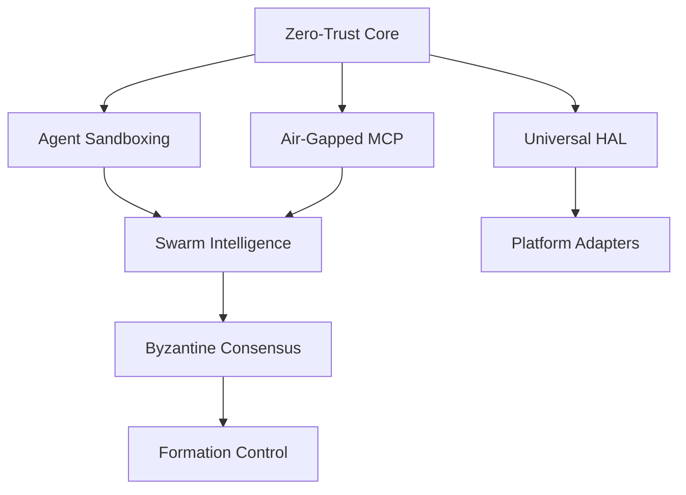

# ALCUB3 Patent Filing Schedule & Priority Matrix

**Strategic IP Protection Timeline**  
*Last Updated: January 10, 2025*

---

## Critical Path Timeline

### 🚨 IMMEDIATE ACTIONS (Next 7 Days)
1. **Engage Patent Attorney** - Tier 1 IP firm with AI/robotics expertise
2. **Conduct Prior Art Search** - Focus on zero-trust and swarm innovations  
3. **Prepare Technical Packages** - Compile implementation evidence
4. **Budget Approval** - Secure $1.1M for Wave 1 filings

---

## Filing Waves & Priorities

### 📅 Wave 1: Core Security (File by February 10, 2025)
**Budget: $1.1M | Patents: 22 | Market: $45.6B**

#### Zero-Trust Architecture (6 Patents) - CRITICAL
| Patent ID | Title | Priority | Dependencies | Filing Cost |
|-----------|-------|----------|--------------|-------------|
| ZT-001 | Microsegmentation Engine with Classification Awareness | CRITICAL | None | $50K |
| ZT-002 | Continuous Verification System with ML Risk Scoring | CRITICAL | ZT-001 | $50K |
| ZT-003 | Identity-Based Access Control (ABAC) Engine | CRITICAL | None | $50K |
| ZT-004 | Device Trust Scorer with Hardware Attestation | HIGH | ZT-002 | $45K |
| ZT-005 | Zero-Trust Policy Engine with Conflict Resolution | HIGH | ZT-003 | $45K |
| ZT-006 | Network Gateway with Software-Defined Perimeter | HIGH | ZT-001 | $45K |

#### Agent Sandboxing (6 Patents)
| Patent ID | Title | Priority | Dependencies | Filing Cost |
|-----------|-------|----------|--------------|-------------|
| AS-001 | Hardware-Enforced Agent Execution Sandboxing | CRITICAL | None | $50K |
| AS-002 | Real-Time Integrity Verification System | CRITICAL | AS-001 | $50K |
| AS-003 | Secure State Persistence | HIGH | AS-001 | $45K |
| AS-004 | Classification-Aware Resource Isolation | HIGH | None | $45K |
| AS-005 | Tamper-Evident Monitoring | MEDIUM | AS-002 | $40K |
| AS-006 | Performance-Optimized Operations | MEDIUM | AS-001 | $40K |

#### Air-Gapped MCP (5 Patents)
| Patent ID | Title | Priority | Dependencies | Filing Cost |
|-----------|-------|----------|--------------|-------------|
| MCP-001 | 30+ Day Offline AI Operation | CRITICAL | None | $55K |
| MCP-002 | Secure .atpkg Transfer Format | CRITICAL | MCP-001 | $50K |
| MCP-003 | State Reconciliation Engine | HIGH | MCP-001 | $45K |
| MCP-004 | Classification-Aware Context | HIGH | AS-004 | $45K |
| MCP-005 | MAESTRO Security Integration | MEDIUM | All above | $40K |

#### CISA Remediation (5 Patents)
| Patent ID | Title | Priority | Dependencies | Filing Cost |
|-----------|-------|----------|--------------|-------------|
| CISA-001 | AI-Powered Misconfiguration Prediction | CRITICAL | None | $50K |
| CISA-002 | Classification-Aware Remediation | HIGH | AS-004 | $45K |
| CISA-003 | Air-Gapped Scanning Capabilities | HIGH | MCP-001 | $45K |
| CISA-004 | Real-Time Threat Correlation | MEDIUM | ZT-002 | $40K |
| CISA-005 | Automated Compliance Validation | MEDIUM | CISA-001 | $40K |

### 📅 Wave 2: Swarm & Robotics (File by March 10, 2025)
**Budget: $1.3M | Patents: 26 | Market: $42.5B**

#### Swarm Intelligence (5 Patents)
- SI-001 through SI-005
- Total: $235K
- Dependencies: Wave 1 complete

#### Byzantine Consensus (8 Patents)
- BC-001 through BC-008
- Total: $380K
- Dependencies: SI-001, SI-002

#### Formation Control (5 Patents)
- FC-001 through FC-005
- Total: $235K
- Dependencies: BC-001, BC-002

#### Universal HAL (8 Patents)
- HAL-001 through HAL-008
- Total: $380K
- Dependencies: AS-004, MCP-001

### 📅 Wave 3: Operations (File by April 10, 2025)
**Budget: $0.9M | Patents: 18 | Market: $15.6B**

- JIT Privilege System (5 patents)
- HSM Integration (4 patents)
- NIST Compliance (4 patents)
- Security Monitoring (5 patents)

### 📅 Wave 4: Platform Support (File by May 10, 2025)
**Budget: $2.0M | Patents: 40 | Market: $55.1B**

- Platform Adapters (13 patents)
- Supporting Innovations (27 patents)

---

## Strategic Considerations

### Patent Claim Strategy

#### Core Claims (File First)
1. **System Claims** - Overall architecture
2. **Method Claims** - Key processes
3. **Apparatus Claims** - Specific implementations

#### Continuation Strategy
- File broad claims initially
- Use continuations for specific implementations
- Reserve divisionals for unexpected prior art

### Geographic Filing Strategy

#### Phase 1: US Priority
- Provisional applications (all 106)
- Non-provisional conversion (selective)
- Track One examination for core 22

#### Phase 2: International (PCT)
- File within 12 months of provisional
- Designate: US, EU, UK, Japan, Korea, Israel
- National phase: Based on market traction

#### Phase 3: Defensive
- China, Russia (defensive publications only)
- Open source non-core implementations
- Standards body contributions

---

## Budget Breakdown

### Wave 1 Detailed Costs
| Category | Items | Cost |
|----------|-------|------|
| Prior Art Search | 22 patents × $5K | $110K |
| Provisional Filing | 22 patents × $15K | $330K |
| Attorney Fees | 22 patents × $25K | $550K |
| Drawings/Figures | 22 patents × $5K | $110K |
| **Total Wave 1** | | **$1.1M** |

### Total Program Cost
| Wave | Patents | Timeline | Cost |
|------|---------|----------|------|
| Wave 1 | 22 | Feb 2025 | $1.1M |
| Wave 2 | 26 | Mar 2025 | $1.3M |
| Wave 3 | 18 | Apr 2025 | $0.9M |
| Wave 4 | 40 | May 2025 | $2.0M |
| PCT Filing | 106 | Jan 2026 | $3.2M |
| **Total** | **106** | | **$8.5M** |

---

## Risk Mitigation Timeline

### Pre-Filing (January 2025)
- [ ] Complete freedom-to-operate analysis
- [ ] Identify potential blocking patents
- [ ] Develop workaround strategies
- [ ] Secure NDA with patent counsel

### During Filing (Feb-May 2025)
- [ ] Monitor competitor filings
- [ ] Track standards body activities  
- [ ] Maintain strict confidentiality
- [ ] Document all implementations

### Post-Filing (June 2025+)
- [ ] Accelerated examination requests
- [ ] Defensive publication strategy
- [ ] License negotiation prep
- [ ] Enforcement planning

---

## Critical Dependencies

### Technical Dependencies

### Legal Dependencies
1. **NDA Execution** - Before any attorney discussions
2. **Assignment Agreements** - All developers must sign
3. **Government Rights** - Clarify SBIR implications
4. **Open Source** - Resolve any GPL dependencies

---

## Success Metrics

### Filing Metrics
- ✅ 22 provisional applications by Feb 10
- ✅ 100% prior art searches complete
- ✅ Zero blocking patents identified
- ✅ All claims reviewed by technical team

### Business Metrics
- 🎯 First licensing deal within 6 months
- 🎯 Patent pending marketing advantage
- 🎯 Competitive barrier established
- 🎯 Valuation increase of 10x

---

## Action Items

### Week 1 (Jan 10-17)
1. **CEO**: Approve $1.1M budget
2. **CTO**: Finalize Wave 1 technical packages
3. **Legal**: Interview top 3 IP firms
4. **Team**: Complete invention disclosures

### Week 2 (Jan 17-24)
1. **Legal**: Engage selected IP firm
2. **IP Firm**: Begin prior art searches
3. **CTO**: Technical briefing to attorneys
4. **Finance**: Setup IP expense tracking

### Week 3 (Jan 24-31)
1. **IP Firm**: Complete Wave 1 drafts
2. **CTO**: Review and refine claims
3. **Legal**: File provisional applications
4. **Marketing**: Prepare patent pending materials

### Week 4+ (Feb 1+)
1. **All**: Wave 2 preparation begins
2. **Legal**: International filing strategy
3. **Business**: Licensing discussions
4. **Technical**: Continuation planning

---

**Document Control**
- Classification: CONFIDENTIAL
- Distribution: C-Suite, Board, IP Counsel
- Review Cycle: Weekly until Wave 1 complete
- Contact: ALCUB3 CTO

*Time is of the essence - every day of delay is a day competitors could file first.*